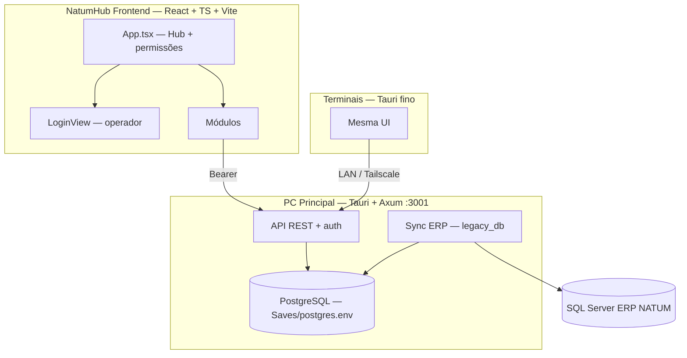

# NatumHub - Guia do Desenvolvedor e Arquitetura

> **Documentação para IAs:** [`ContextoIA/INDEX.md`](ContextoIA/INDEX.md) — leia o índice antes de explorar o código.

Bem-vindo ao **NatumHub**, o painel unificado para operações da Nátum Cosméticos.

---

## 1. Visão Geral

Stack: **Tauri 2 + React + Axum (:3001) + PostgreSQL**.

1. **Produção**: estoque, faturamento, fabricação, alertas de reposição.
2. **Compras**: demandas, cotações, NFs.
3. **Microbiologia / Físico-química**: laudos e medições.
4. **Financeiro**: Tiny ERP (cache no Postgres) — ver `Backend/src/modules/financeiro/docs/README.md`.

### Banco de dados (importante)

| O quê | Onde |
|-------|------|
| **Dados do app** (operadores, settings, estoque cache, feedbacks, …) | **PostgreSQL no PC Principal** via `Saves/postgres.env` |
| **ERP** | SQL Server remoto — sync só no master |
| **Terminais** | Sem banco local — só HTTP → API do master |

**Não** há SQLite operacional. Arquivos como `Saves/data.db` (se existirem) são legado e **não** são usados pelo app.

Instalação Postgres: [`ContextoIA/devops/instalacao_postgres_master.md`](ContextoIA/devops/instalacao_postgres_master.md).

---

## 1.1 Multi-usuário

| Conceito | Descrição |
|----------|-----------|
| **PC Principal** | `appMode: master` — Axum, PostgreSQL, sync ERP, backups, updater |
| **Terminal** | `appMode: client` — UI fina → `apiOrigin` do master |
| **Operadores** | Login local; permissões por `module_key` |
| **Notificações** | Por módulo; filtradas por permissões |

Doc: [`ContextoIA/arquitetura/multi_usuario.md`](ContextoIA/arquitetura/multi_usuario.md)

Sync ERP: [`ContextoIA/erp-import/README.md`](ContextoIA/erp-import/README.md) · [`erp-import/`](erp-import/)

---

## 2. Mapa do Projeto

**Não varrer o repo.** Usar [`ContextoIA/INDEX.md`](ContextoIA/INDEX.md).

| Caminho | Conteúdo |
|---------|----------|
| `Frontend/src/App.tsx` | Hub, views |
| `Frontend/src/modules/geral/lib/http.ts` | Cliente API (Bearer) |
| `Frontend/src/modules/geral/lib/connectionConfig.ts` | master/client |
| `Backend/src/lib.rs` | Axum + Tauri |
| `Backend/src/core/pg_db.rs` | Pool PostgreSQL |
| `Backend/src/core/legacy_db.rs` | Sync ERP |
| `Backend/supabase/` | Schema DDL |
| `erp-import/` | Queries SQL sync |
| `Saves/` | `postgres.env`, `client_config.json` (secrets fora do git) |
| `ContextoIA/` | Docs para IA |

Schema: [`ContextoIA/banco-dados/`](ContextoIA/banco-dados/) + `Backend/supabase/`.

---

## 3. Diretrizes de Codificação

### Null safety (evitar tela branca)
Trate campos opcionais do banco com fallbacks antes de `toLowerCase` / métodos de string. Use optional chaining.

### Error Boundaries
Views em `App.tsx` usam `ErrorBoundary` — isole falhas por módulo.

### Tailwind v4
Não use reset universal `* { margin/padding }` — zera utilitários `:where()`.

---

## 4. Feedbacks

Widget de feedback → Postgres (`feedbacks`). Playbook: [`Feedbacks/feedback.md`](Feedbacks/feedback.md).
