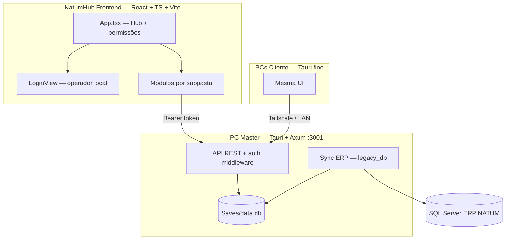

# NatumHub - Guia do Desenvolvedor e Arquitetura

> **Documentação para IAs** foi reorganizada em [`ContextoIA/`](ContextoIA/INDEX.md) — use o índice antes de explorar o código.

Bem-vindo ao **NatumHub**, o painel unificado e integrado para gerenciamento das operações da Nátum Cosméticos.

---

## 1. Visão Geral do Sistema

O NatumHub unifica aplicativos legados e novos módulos em um único ecossistema:
1. **Produção**: Controle de estoque, faturamento, histórico de fabricação e alertas de reposição.
2. **Compras**: Planejamento de demandas por média histórica, cotações com múltiplos fornecedores e controle de Notas Fiscais (NFs).
3. **Análise Microbiológica**: Controle de qualidade laboratorial, registros de testes microbianos e emissão de laudos de lote.
4. **Financeiro**: Contas a pagar/receber via Tiny ERP (cache SQLite, reconciliação na sync, dashboard de fluxo/aging/projeção). Ver `Backend/src/modules/financeiro/docs/README.md`.



---

## 1.1 Fase multi-usuário (v0.0.11+)

| Conceito | Descrição |
|----------|-----------|
| **PC Principal** | `appMode: master` — único com `data.db`, sync ERP, backup |
| **PC Secundário** | `appMode: client` — UI fina, HTTP → principal (sem SQLite local) |
| **Principal único** | Admin registra via `/api/hub/claim-principal` + `deviceId` |
| **Operadores** | Login local; permissões por `module_key` |
| **Notificações** | Por módulo; filtradas por permissões; sync ERP → `hub_settings` |
| **Firebase** | Só backup nuvem no principal |

**Doc IA compacta:** [`ContextoIA/arquitetura/multi_usuario.md`](ContextoIA/arquitetura/multi_usuario.md) · **Índice:** [`ContextoIA/INDEX.md`](ContextoIA/INDEX.md)

**Sync ERP:** [`ContextoIA/erp-import/README.md`](ContextoIA/erp-import/README.md) · [`erp-import/README.md`](erp-import/README.md)


## 2. Mapa do Projeto (leitura dirigida)

**Não varrer o repo.** Usar [`ContextoIA/INDEX.md`](ContextoIA/INDEX.md).

| Caminho | Conteúdo |
|---------|----------|
| `Frontend/src/App.tsx` | Hub, views, ErrorBoundary |
| `Frontend/src/modules/geral/lib/http.ts` | Cliente API (Bearer) |
| `Frontend/src/modules/geral/lib/auth.ts` | Operadores |
| `Frontend/src/modules/geral/lib/connectionConfig.ts` | master/client |
| `Frontend/src/modules/geral/components/layout/` | Header, NotificationsPanel |
| `Backend/src/lib.rs` | Axum + Tauri |
| `Backend/src/core/legacy_db.rs` | Sync ERP |
| `Backend/src/modules/geral/auth/` | Auth middleware |
| `Backend/src/modules/geral/notifications/` | Notificações |
| `erp-import/` | Queries SQL sync (docs) |
| `Saves/` | `data.db`, `client_config.json` |
| `ContextoIA/` | Docs para IA — [`ContextoIA/INDEX.md`](ContextoIA/INDEX.md) |

---

## 3. Banco de Dados Compartilhado (`data.db`)

Para evitar reiniciar a compilação do Tauri continuamente durante o desenvolvimento, o arquivo **`data.db`** é mantido na pasta **`c:\api\Saves\data.db`** (fora do diretório de compilação do Tauri).

### Tabelas Principais e Relações

#### Cadastro e Integração de Estoques
*   `produtos` (código, descrição, linha_prefix, base, media_levantamento): Cadastro compartilhado de todos os produtos acabados e insumos da produção.
*   `config_linhas` (linha_prefix, nome_linha, estoque_ideal_mult, abrir_ordem_mult, abrir_prod_mult, fator_seguranca_z, visivel): Multiplicadores de meses de estoque recomendados para calcular alertas (Crítico, Alerta, Saudável).
*   `estoque_atual` (codigo, estoque, producao, pedidos_aberto, fase): Armazena os números atuais sincronizados pelo importador de planilhas.
*   `overrides_produtos` (codigo, estoque_ideal_manual, pedidos_manual, media_manual, is_lancamento_manual, visivel, observacao, linha_prefix_manual): Permite forçar dados no algoritmo de alertas se necessário.

#### Fluxo de Compras (Insumos e Pedidos)
*   `items`: Cadastro detalhado de insumos de compras.
*   `categories`: Árvore de categorias de produtos e matérias-primas.
*   `suppliers`: Fornecedores de insumos.
*   `invoices`: Detalhamento de notas fiscais importadas (usado para calcular médias de consumo histórico por ano).
*   `quotations` & `quotation_items` & `quotation_prices`: Armazenamento de cotações com múltiplos fornecedores e o resultado final selecionado para pedido.

#### Fluxo Laboratorial (Microbiologia)
*   `reports`: Resultados microbiológicos emitidos e assinados para controle de lotes.

#### Feedback & Diagnósticos
*   `feedbacks` (id, type, description, page, logs, screenshot, status, createdAt, resolvedAt): Registro de bugs e melhorias.

---

## 4. Diretrizes de Codificação e Boas Práticas

Ao implementar novas features ou correções, siga rigorosamente estas diretrizes para manter a estabilidade do app e reduzir bugs na interface:

### 1. Prevenção de Telas em Branco (Null Safety)
Telas em branco ocorrem quase exclusivamente devido a exceções de tipo não capturadas no ciclo de renderização do React ao acessar propriedades nulas oriundas do banco de dados (ex: `null.toLowerCase()`).
*   **Sempre** trate campos opcionais ou strings do banco de dados com fallbacks antes de aplicar manipulações de string:
    ```typescript
    // Incorreto (Pode quebrar se description for nulo)
    const matches = item.description.toLowerCase().includes(query);

    // Correto (Null-safe)
    const matches = (item.description || '').toLowerCase().includes(query);
    ```
*   **Utilize Optional Chaining** (`?.`) ao lidar com vetores ou propriedades aninhadas que podem não ser populadas:
    ```typescript
    {item.prices?.map(price => ( ... ))}
    ```

### 2. Tratamento de Erros e Recuperação (Error Boundaries)
Todas as visualizações de módulo principal no arquivo [`App.tsx`](file:///c:/api/Frontend/src/App.tsx) estão envolvidas por uma classe [`ErrorBoundary`](file:///c:/api/Frontend/src/modules/geral/components/ErrorBoundary.tsx).
*   Se ocorrer uma exceção de renderização em algum componente, o erro será isolado a este módulo. A tela exibirá um diagnóstico detalhado com a pilha de chamadas e um botão para o usuário "Voltar ao Hub", evitando o travamento completo do app.

### 3. Especificidade de Estilo (Tailwind v4 CSS)
O NatumHub utiliza **Tailwind CSS v4**. Nesta versão, as classes utilitárias são injetadas com a pseudo-classe `:where()`, o que dá especificidade zero a elas.
*   **Nunca** defina regras de reset globais com o seletor universal `*` (como `* { margin: 0; padding: 0 }`) no seu arquivo CSS principal, pois isso irá anular todas as classes de espaçamento (`space-y-4`, `p-6`, `m-2`) do Tailwind.
*   Mantenha a estética Zinc (tons suaves de cinza, bordas sutis e botões em preto/zinc-900).

---

## 5. Ciclo de Feedback e Sincronização Dinâmica

Para facilitar o diagnóstico imediato de bugs diretamente pelo modelo de IA, o aplicativo conta com o **FeedbackWidget** (ícone de inseto flutuante no canto inferior direito).

1.  **Captura automática**: O widget captura a página atual, a descrição do usuário, os logs do console de depuração e, opcionalmente, um print de tela por imagem.
2.  **Escrita Automática em Markdown**: Sempre que um feedback é criado ou resolvido, o backend em Rust gera e escreve a lista de pendências nos arquivos:
    *   **[`c:\api\Feedbacks\feedback.md`](file:///c:/api/Feedbacks/feedback.md)** (Índice de Feedbacks)
    *   **[`c:\api\Feedbacks\feedback_<id>\`](file:///c:/api/Feedbacks/)** (Pastas individuais por feedback, contendo metadados, logs, imagens e arquivos de resolução)
3.  **Acesso Rápido**: Em conversas de manutenção, você pode apenas ler o arquivo `Feedbacks/feedback.md` para ver a lista de bugs pendentes, quais páginas falharam e os logs exatos do console capturados no momento do erro.
