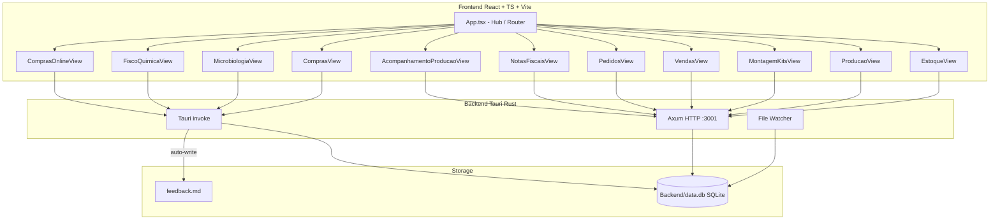

# NatumHub — Arquitetura e guia do desenvolvedor

Painel unificado (desktop Tauri + React) para operações da Nátum Cosméticos. Versão atual: **`0.0.11-alpha`** (`Frontend/package.json`, `Backend/NatumHub/Cargo.toml`, `Backend/NatumHub/tauri.conf.json`).

Caminhos neste documento são **relativos à raiz do repositório**. Não use caminhos absolutos de máquina (Windows/`antigravity`).

Documentação de segurança (token, bind, CORS, settings mascarados): [`.ai_context/security.md`](.ai_context/security.md).

---

## 1. Visão geral

O Hub unifica os apps legados (Produção, Compras, Análise Microbiológica, Físico-Química) num único executável e um SQLite compartilhado (`Backend/data.db`).



### Módulos do Hub (`Frontend/src/App.tsx`)

| Módulo | View | Canal | Hub pai |
|--------|------|-------|---------|
| **Estoque** | `Frontend/src/modules/EstoqueView.tsx` (insumos / produtos / ativos) | HTTP | `estoque_hub` |
| **Produção** | `Frontend/src/modules/ProducaoView.jsx` | HTTP | `producao_hub` |
| **Kits** | `Frontend/src/modules/MontagemKitsView.jsx` | HTTP | `producao_hub` |
| **Microbiologia** | `Frontend/src/modules/MicrobiologiaView.tsx` | Tauri invoke | `producao_hub` |
| **Físico-Química** | `Frontend/src/modules/FiscoQuimicaView.tsx` | Tauri invoke | `producao_hub` |
| **Compras** | `Frontend/src/modules/ComprasView.tsx` (MP, embalagens, coloração, apoio, cotações) | Tauri invoke (+ HTTP para detalhes) | `compras_hub` |
| **Pedidos** | `Frontend/src/modules/PedidosView.tsx` | HTTP | `compras_hub` |
| **NFs** | `Frontend/src/modules/NotasFiscaisView.tsx` | HTTP | `compras_hub` |
| **Compras Online** | `Frontend/src/modules/ComprasOnlineView.tsx` | Tauri invoke | `compras_hub` |
| **Vendas** | `Frontend/src/modules/VendasView.tsx` | HTTP | raiz |
| **Acompanhamento** | `Frontend/src/modules/AcompanhamentoProducaoView.tsx` | HTTP | `administrativo_hub` |
| **Linha de produtos** | `Frontend/src/modules/ActiveProductsView.tsx` | HTTP | raiz / estoque |

---

## 2. Dois canais: Tauri invoke vs Axum HTTP

O frontend fala com o backend por **dois canais distintos**. Não misture os padrões.

| Canal | Quando usar | Como o frontend chama |
|-------|-------------|------------------------|
| **Tauri `invoke`** | Módulos que nasceram nos apps isolados (Compras, Microbiologia, FQ, Compras Online, feedback, backup) | `Frontend/src/lib/api.ts` → `invoke('comando')` registrado em `generate_handler!` (`Backend/NatumHub/src/lib.rs`) |
| **Axum HTTP** | Estoque, Produção, Kits, Vendas, Pedidos, NFs, Acompanhamento, settings, import/sync, Google | `API_BASE` + `apiFetch` em `Frontend/src/lib/utils.ts` |

Mapas canônicos:

- Rotas HTTP: [`.ai_context/api_routes.md`](.ai_context/api_routes.md)
- Comandos Tauri: [`.ai_context/tauri_commands.md`](.ai_context/tauri_commands.md)

### Views HTTP: `API_BASE` + Bearer via `apiFetch`

As views HTTP **não** hardcodedam `127.0.0.1` como padrão de chamada. Todas usam o `API_BASE` unificado e o Bearer via `apiFetch`:

```ts
// Frontend/src/lib/utils.ts
export const API_BASE = /* VITE_API_URL → localStorage.natum_api_base → hostname:3001/api → 127.0.0.1:3001/api */
export async function apiFetch(input, init) {
  return fetch(input, { ...init, headers: hubAuthHeaders(init?.headers) });
}
```

Prioridade de `API_BASE`:

1. `VITE_API_URL`
2. `localStorage.natum_api_base` (campo Servidor no Hub)
3. `http://<window.location.hostname>:3001/api` se o host não for loopback
4. Fallback local `http://127.0.0.1:3001/api`

Token: `localStorage.natum_hub_token`, `VITE_HUB_TOKEN`, ou `invoke('get_hub_token')` no desktop do servidor. Detalhes em [`.ai_context/security.md`](.ai_context/security.md).

---

## 3. Bind / CORS / Bearer (P0)

Padrão Tailscale: bind **`0.0.0.0:3001`**. Override: `NATUM_BIND` (host ou `host:porta`).

| Modo | Bind | Auth |
|------|------|------|
| A (local) | `NATUM_BIND=127.0.0.1` | Bearer **opcional** |
| B (padrão / Tailscale) | `0.0.0.0:3001` | Bearer **obrigatório** em `/api/*` |

- CORS é **allowlist** (não `Any`): `http://localhost:5175`, `http://127.0.0.1:5175`, `tauri://localhost`, `https://tauri.localhost`. Extras: `NATUM_CORS_ORIGINS`.
- Bearer exigido em bind não-loopback para **todas** as rotas `/api/*`.
- Exceção: `GET /api/google/callback` (redirect OAuth).
- `NATUM_AUTH=required|optional` força o modo independentemente do bind.

**Nunca commitar** `sql_password`, `hub_token`, Firebase ou Google `client_secret`. Ver [`.ai_context/security.md`](.ai_context/security.md).

---

## 4. Mapa do projeto (raiz do repo)

Para reduzir tokens, leia só o caminho do módulo em que está trabalhando.

* **`Frontend/`** — React + Vite + Tailwind v4
    * **`Frontend/src/App.tsx`** — Hub, views e `ErrorBoundary` por módulo
    * **`Frontend/src/types.ts`** — Tipos compartilhados
    * **`Frontend/src/modules/`** — Views listadas na tabela acima
    * **`Frontend/src/components/`** — Compras, produção, microbiologia, shared
    * **`Frontend/src/lib/utils.ts`** — `API_BASE`, `apiFetch`, token
    * **`Frontend/src/lib/api.ts`** — Wrappers `invoke`
    * **`Frontend/src/index.css`** — Tokens Zinc (valores reais no arquivo)
    * **`Frontend/src/components/shared/ErrorBoundary.tsx`** — Isolamento de crash de render
* **`Backend/NatumHub/`** — Tauri + Axum + SQLite
    * **`Backend/NatumHub/src/lib.rs`** — `generate_handler!`, Axum router, `initialize_hub_db`
    * **`Backend/NatumHub/src/db.rs`** — Migrations incrementais + `include_str!("../schema.sql")`
    * **`Backend/NatumHub/src/auth.rs`** — Bind, CORS, Bearer
    * **`Backend/NatumHub/src/watcher.rs`** — Watcher de planilhas
    * **`Backend/NatumHub/schema.sql`** — Schema de produção/estoque/vendas/kits
    * **`Backend/NatumHub/tauri.conf.json`** — Build desktop
* **`Backend/data.db`** — SQLite compartilhado (fora do crate, para não forçar rebuild)
* **`.ai_context/`** — Guias para IAs (rotas, comandos, schema, estilo, GitHub, segurança)
* **`Docs/`** — Blueprints **históricos** (pré-unificação). Ver banners nos arquivos.

---

## 5. Banco de dados (`Backend/data.db`)

O schema **não** é só `schema.sql`. A inicialização é a soma de três fontes:

1. **`Backend/NatumHub/schema.sql`** — produção, estoque, faturamento, kits, vendas, pedidos de compra, movimentações, formulações (aplicado em `db.rs` via `execute_batch`)
2. **`initialize_hub_db`** em `Backend/NatumHub/src/lib.rs` — Compras (items, quotations, invoices…), microbiologia (`products`, `reports`), FQ, feedback, online orders/stores, similar items
3. **Migrations em `Backend/NatumHub/src/db.rs`** — colunas novas (`overrides_produtos`, snapshots de `historico_producao`, `vira_composicao` / `vira_ordens`, `lote_custom_status`, etc.)

Blueprint completo: [`.ai_context/database_blueprint.md`](.ai_context/database_blueprint.md).

---

## 6. ErrorBoundary

Todas as views de módulo em `Frontend/src/App.tsx` estão envolvidas por [`Frontend/src/components/shared/ErrorBoundary.tsx`](Frontend/src/components/shared/ErrorBoundary.tsx).

Se um módulo lança na renderização, o erro fica isolado: diagnóstico + pilha + botão para voltar ao Hub. Não use o caminho antigo `Frontend/src/components/ErrorBoundary.tsx` (não existe).

---

## 7. Diretrizes de código

### Null safety (telas em branco)

Campos SQLite nulos quebram `.toLowerCase()` / `.map()` no React.

```typescript
const matches = (item.description || '').toLowerCase().includes(query);
{item.prices?.map(price => ( ... ))}
```

### Tailwind v4

Classes saem em `:where()` (especificidade zero). **Não** use `* { margin: 0; padding: 0 }` em `Frontend/src/index.css`. Estética Zinc (cinza suave, botões zinc-900). Tokens canônicos estão no CSS; o guia de estilo pode citar HSL ilustrativos que diferem um pouco — confira o arquivo.

---

## 8. Feedback

`Frontend/src/components/shared/FeedbackWidget.tsx` (ícone flutuante). Ao criar/resolver, o Rust atualiza `feedback.md` na raiz. Em manutenção, leia esse arquivo para bugs pendentes, página e logs do console.
