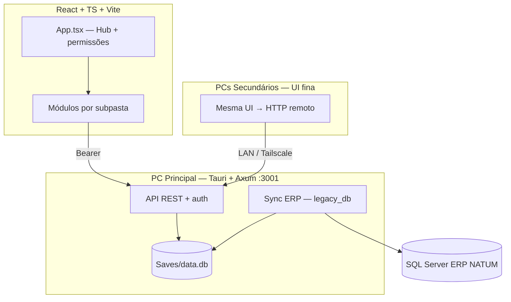

# Visão geral — NatumHub

ERP desktop unificado para Nátum Cosméticos: **Tauri 2 + React 19 + Rust Axum + SQLite**.

## Módulos de negócio

| Área | Função |
|------|--------|
| **Produção** | Estoque acabado, faturamento, ordens, kits, microbiologia, físico-química |
| **Compras** | Demandas, cotações, pedidos, NFs, compras online |
| **Estoque** | Insumos, produtos, linha de produtos |
| **Vendas** | Pedidos e faltas (cache ERP) |
| **Financeiro** | Contas Tiny ERP, fluxo, aging |
| **Geral** | Auth operadores, config, backup, notificações, feedbacks |

## Diagrama (multi-usuário)

## Princípios

- **PC Principal** (`appMode: master`): único com SQLite, sync ERP, backup.
- **PC Secundário** (`appMode: client`): só UI; dados via API do principal.
- **Auth operador local** — Firebase só backup nuvem no principal.
- **Permissões** por `module_key` — registry espelhado FE/BE.
- **REST preferido** — invoke Tauri legado só no principal.

Detalhes rede/auth: [`multi_usuario.md`](multi_usuario.md) · Sync ERP: [`../erp-import/README.md`](../erp-import/README.md)
