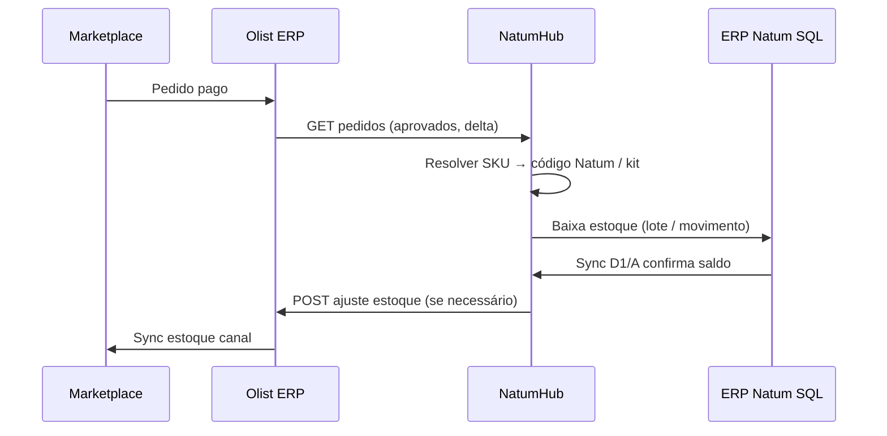

# Vendas Online — integração Olist (estudo)

> Módulo placeholder. Este documento orienta a implementação futura.

## Objetivo

Centralizar vendas dos canais digitais (Mercado Livre, Shopee, site próprio, etc.) via **Olist ERP** (ex-Tiny), com:

- Importação de pedidos aprovados
- Baixa automática de estoque no NatumHub / ERP legado
- Decomposição correta de **kits** (composição → insumos/produtos)
- Conciliação de SKU/código entre marketplace ↔ Olist ↔ Natum

## API Olist (ERP v3)

| Recurso | Uso no NatumHub |
|---------|-----------------|
| **OAuth2** (`client_id`, `client_secret`) | Credenciais em Configurações (PC Principal) |
| **Pedidos** `GET/POST /pedidos` | Polling ou webhook: novos pedidos, situação, itens |
| **Estoque** API de Estoque | Consulta saldo/reserva por depósito; ajustes entrada/saída |
| **Produtos** | Mapeamento SKU ↔ `cCodProd` / `cReferencia` Natum |
| **Expedição / Separação** | Fila de picking (fase 2, junto ao módulo Expedição) |
| **Gatilhos** | Automações no Olist (avaliar se Hub substitui ou complementa) |

Documentação: [api-docs.erp.olist.com](https://api-docs.erp.olist.com/)

## Sincronização de estoque (Olist → canais)

A [Central de Ajuda Olist](https://ajuda.olist.com/gestao-de-estoque/sincronizacao-de-estoque) descreve limites mensais de sync por plano (150k–900k). **Movimentações só no ERP não consomem cota** — apenas envios para plataformas conectadas.

Implicação para o NatumHub:

1. **Fonte da verdade** continua sendo o ERP Natum (SQL Server) + sync D1/A.
2. Olist recebe **ajustes de estoque** quando o Hub/ERP Natum movimentar.
3. Olist propaga para marketplaces (respeitando limites do plano).
4. Evitar loop: Hub não deve reimportar estoque do Olist como fonte primária.

## Fluxo proposto (fase 1)



## Kits

1. Pedido Olist com SKU de kit → buscar composição no Natum (`formulacoes` / tabela kits).
2. Baixar **componentes** (insumos + embalagens), não só o SKU pai.
3. Registrar vínculo `pedido_olist_id` ↔ `lote_baixa` / `stock_movements` para auditoria.

## Tabelas SQLite (futuro)

| Tabela | Função |
|--------|--------|
| `olist_credentials` | OAuth tokens (settings ou tabela dedicada) |
| `olist_product_map` | `sku_olist` → `item_code` Natum |
| `olist_orders` | Pedidos importados + status sync |
| `olist_order_items` | Itens + qty + kit expandido |

## Backend (futuro)

```
Backend/src/modules/vendas/vendas_online/
├── mod.rs
├── handlers.rs      # /api/hub/vendas-online/*
├── olist_client.rs  # OAuth + rate limit
└── sync_scheduler.rs
```

## Rate limit e operação

- Respeitar limites da API v3 (por plano).
- PC Principal executa sync; secundários consomem API local.
- Log de cada baixa + retry em falha de mapeamento SKU.

## Próximos passos sugeridos

1. Credenciais OAuth Olist em Configurações
2. Tela de mapeamento SKU (produto + kit)
3. Job: importar pedidos das últimas 24h
4. Baixa automática com preview manual (modo supervisão)
5. Integração com módulo **Expedição** para separação
