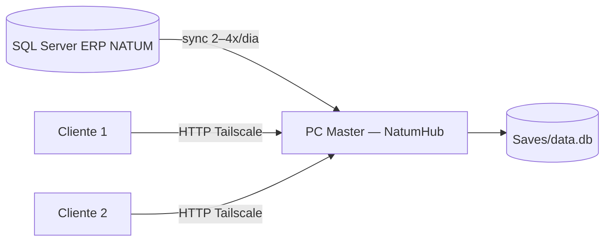

# Importação ERP NATUM → NatumHub

Documentação para IAs: [`ContextoIA/erp-import/README.md`](../ContextoIA/erp-import/README.md)

Documentação visual da sincronização entre o **SQL Server (ERP NATUM)** e o **SQLite** (`Saves/data.db`).

## Onde está o código

| Item | Caminho |
|------|---------|
| Implementação Rust | [`Backend/src/core/legacy_db.rs`](../Backend/src/core/legacy_db.rs) — função `sync_from_sql_server` |
| Trigger HTTP | `POST /api/import/sync` → [`Backend/src/handlers/imports.rs`](../Backend/src/handlers/imports.rs) |
| CLI manual | [`Backend/src/bin/run_sync.rs`](../Backend/src/bin/run_sync.rs) |
| Config conexão SQL | Settings `sql_host`, `sql_port`, `sql_user`, `sql_password`, `sql_database` |

## Arquitetura (fase multi-usuário)



- **Sync ERP só no PC Principal** (`appMode: master` em `Saves/client_config.json`).
- Clientes finos não rodam importação; consomem o banco via API do master.
- Antes de cada sync: backup automático de `data.db` ([`db_backup.rs`](../Backend/src/core/db_backup.rs)).

## Fluxo da importação

1. Conectar ao SQL Server (settings ou env).
2. **Buscar** todos os passos A→N no ERP (queries em [`sql/`](sql/)).
3. **Gravar** no SQLite em transação única (replace/insert por tabela).
4. Registrar histórico em `historico_importacoes`.

Detalhes por passo: [`PASSOS.md`](PASSOS.md)  
Mapeamento ERP → SQLite: [`DESTINO-SQLITE.md`](DESTINO-SQLITE.md)

## Pastas

```
erp-import/
├── README.md           ← este arquivo
├── PASSOS.md           ← índice A–N com módulos que consomem os dados
├── DESTINO-SQLITE.md   ← tabelas destino no data.db
└── sql/                ← queries SQL Server (espelho do legacy_db.rs)
    ├── A-produtos.sql
    ├── B-fornecedores.sql
    …
    └── N-pedidos-venda-itens.sql
```

## Como executar

**Pela UI (master):** Configurações → Sincronização ERP → *Sincronizar ERP*

**Pela API:**
```http
POST /api/import/sync
Authorization: Bearer <token admin>
```

**Pelo binário (dev):**
```bash
cd Backend
cargo run --bin run_sync
```

## Settings de conexão

| Chave | Descrição |
|-------|-----------|
| `sql_host` | IP/hostname do SQL Server |
| `sql_port` | Porta (padrão 1433) |
| `sql_user` | Usuário |
| `sql_password` | Senha |
| `sql_database` | Nome do banco ERP |

> **Removido:** `sales_sync_start_date` — o histórico de vendas (passo J) importa **todas** as linhas de VENDAS2.

## Manutenção

Ao alterar uma query no Rust, **atualize o `.sql` correspondente** nesta pasta para manter a documentação alinhada.
